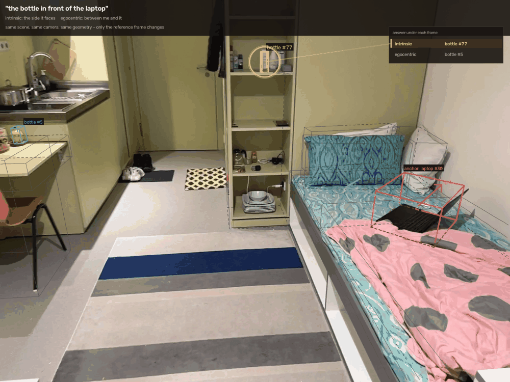

# Spatial query engine — reference-frame-aware relation resolution

You walk through a room filming with a phone. The system builds a 3-D map that
knows what each object is and where it sits relative to everything else, so you
can type *"the second mug from the left on the middle shelf"* and it points at
exactly that one.

The part that is actually hard is the phrase **"from the left"**.

> *"Left of the laptop"* — left from whose view? The camera's, the laptop's own
> front, or the room's canonical axes? Pipelines that ground spatial language
> compute this from object coordinates without committing to, or reporting, a
> frame. Because the resulting failure looks like a wrong object, it gets counted
> as a perception error and attacked with a bigger detector.

That is a narrow claim and it is checkable, so here is the check. **SpatialRGPT**
defines its relation set as "left, right, above, below, behind, front …" and
computes it by traversing object nodes and using "the point cloud centroids and
bounding boxes" — no frame named. **SpatialVLM** asks "which is more towards the
left?" and, in one template, "how far is A positioned behind B *relative to the
camera*" — so the frame is the camera's, stated inside a template string rather
than as a modelling commitment. Literal quotes, page numbers and the rest of the
positioning are in **[docs/RELATED_WORK.md](docs/RELATED_WORK.md)**.

The frame trichotomy itself is not new — it is standard in linguistics, and
Levinson (2003) devotes a chapter to it. **The contribution here is making it
operational in a 3-D pipeline and measuring it, not discovering it.**

## The strongest finding: Sr3D fixes the frame and mislabels it

**Sr3D** — 83,572 template-generated utterances, the field's standard spatial-
reference benchmark for 3-D grounding — has a relation class called
**`allocentric`** covering "left", "right", "front", "back", at ~8% of the data,
so **≈6,700 projective utterances**. The ReferIt3D ECCV 2020 supplementary
(§2.5, p.9) defines it:

> "These relations indicate where a target object might exist **with respect to
> the anchor orientation** […] whether the anchor objects have an **intrinsic
> front view** […] we utilized the **Scan2CAD** annotations that provide **9DOF
> alignments** […] we create **four oriented sections** (front, back, left, and
> right)."

That is the **intrinsic** frame. *Allocentric*, in the standard taxonomy
(Levinson 2003, ch. 2), means the world frame — the opposite. And searching the
whole 13-page supplementary for `camera`, `viewer`, `observer`, `point of view`
and `egocentric` returns **zero matches**: Sr3D contains no viewer-relative
projective utterances at all, not a few, none. The relative reading — the
dominant one for "left of X" in ordinary English — is absent by construction.

To be fair to the authors: the convention **is** documented, in supplementary
material. So the claim is not "they never say so". It is that a single intrinsic
convention is applied uniformly to ~6,700 utterances under a name that denotes
the opposite frame, so a model evaluated on Sr3D is rewarded for the intrinsic
reading and penalised for the relative one, and no headline number reveals it.

How much does that choice cost? On my five ScanNet++ scenes, forcing the
intrinsic frame changes **34.0%** of answerable frame-dependent answers relative
to the natural-default policy. Details and what remains to be checked:
**[docs/EXTERNAL_BENCHMARK_AUDIT.md](docs/EXTERNAL_BENCHMARK_AUDIT.md)**.

## How often does the frame change the answer?

On **882 queries over 5 ScanNet++ scenes, ground-truth perception, no annotation
used**:

### Two plausible frames pick different objects on 4.1% of frame-dependent queries
#### unenriched random sample · 21 of 512 · lateral 4.8%, frontal 2.6%
#### stable under threshold perturbation: median 3.7%, 2.9–5.1% at the 10th–90th percentile

Across 20 trials jittering all 43 query-time constants by ±30%, the rate stays in
**2.0–6.8%** ([results/robustness/](results/robustness/robustness.md)). Unlike the
enriched figure, 4.1% sits *near* the perturbed median rather than above it, so it
is not a lucky threshold setting.

**Correction.** An earlier version of this README said 18.8%. That number came
from an item set the proposal generator had **enriched for frame sensitivity** —
it sorts frame-sensitive candidates first, then caps — so 18.8% was a rate over
*queries selected for being frame-sensitive*, inflated **4.6×**. Both runs are
kept: [unenriched](results/sensitivity_unenriched/sensitivity.md) (the population
rate, quote this) and [enriched](results/sensitivity/sensitivity.md) (which says
only that deliberately looking for such queries finds 96 in 512). Every report
now prints a banner declaring which it is, and `sqe propose --no-enrich` samples
at random.

The mutual-disagreement rate is the one to quote: it makes no reference to which
frame is *correct*, so it does not depend on my policy being right, and it is a
lower bound — a frame that cannot be constructed counts as agreement.

Forcing a single fixed convention changes **34.0%** (intrinsic), **30.3%**
(addressee) or **34.2%** (world) of *answerable* frame-dependent answers, against
4.3% for egocentric — which is low only because the policy already chooses
egocentric on 387 of 512. That is **not** an error rate: it measures divergence
from my policy, which is itself unvalidated.

## Can a system be instructed into a frame?

`sqe minimal-pairs` builds sentences differing **only** in an explicit marker of
whose left is meant, on scenes where the two readings provably pick different
objects — 35 validated pairs from 4 of the 5 scenes, plus 35 non-contrastive control
paraphrases matched for awkwardness.

The metric is calibrated against systems whose behaviour is known in advance: the
cue-following resolver scores **100% switched-correctly** (a circularity check —
the pairs were built from its own frames, so this only proves the stimulus is
well-formed), and all four pinned-frame controls score **100% frame-blind** with
**100% control-stability**, which is what makes the `frame_blind` label
attributable rather than a parse artefact.

### The result

Two models, given the scene as a listing of ids, classes, box centres and sizes,
plus the observer's stated position:

| system | pairs | switched correctly | frame blind | switched wrongly | partial | control stable |
|---|---|---|---|---|---|---|
| resolver, cue-following *(circularity check)* | 35 | 100.0% | 0.0% | 0.0% | 0.0% | 100.0% |
| resolver, frame pinned *(positive control)* | 35 | 0.0% | **100.0%** | 0.0% | 0.0% | 100.0% |
| Claude Opus 5 *(self-administered)* | 35 | 42.9% | **25.7%** | 11.4% | 20.0% | 80.0% |
| Claude Haiku 4.5 *(self-administered)* | 35 | 5.7% | **48.6%** | 14.3% | 25.7% | 37.1% |

Restricted to the pairs where each system answered its **own** control pair
consistently — the item-level stability check, and the only reading of
`frame_blind` that survives a noisy system:

| system | pairs kept | switched correctly | frame blind | partial |
|---|---|---|---|---|
| Claude Opus 5 | 28 of 35 | 12 (42.9%) | **8 (28.6%)** | 5 (17.9%) |
| Claude Haiku 4.5 | 13 of 35 | 1 (7.7%) | **8 (61.5%)** | 3 (23.1%) |

Told explicitly which frame to use, the stronger model gave the **identical
answer to both arms** on 8 of 28 pairs, and got both arms right on 12. Split by
relation, it followed an explicit *lateral* cue far more often than an explicit
*frontal* one (8 of 11 `right` pairs correct; 6 of 14 `front` pairs frame-blind)
— which is what the front/back-is-intrinsic default predicts. With no marker at
all, its answer matches the egocentric reading on 22 of 35.

**Read the Haiku row as a failed precondition, not a finding.** 37% control
stability means it answers two identical-in-meaning paraphrases differently, so
its frame-blindness is unattributable. That is what the negative control is for.

**Three caveats, none of them optional:**

1. This arm is **self-administered** — each block of trials went to an isolated
   agent of the same model family that wrote the stimulus. Blocking removes the
   side-by-side comparison; it does not remove the author's knowledge of what was
   being tested. It is a pilot. `sqe frame-probe --model frontier --preflight`
   then `--model anthropic:… openai:… google:…` runs the independent version and
   needs only an API key.
2. On the **control** sentences — plain, no frame marker — Opus agreed with this
   resolver on only 16 of 35. The controls test stability, not correctness, so
   this says the model and I disagree on ordinary sentences about half the time,
   and *which of us is right is unmeasured*. The probe supports "an explicit
   frame instruction often does nothing"; it does not support "the model is worse
   at spatial language than this resolver".
3. Four trials named an anchor missing from the object listing (room-fixed
   objects were filtered out, and some anchors are room-fixed). Four answerers
   reported it independently with no shared context and no access to the key.
   Fixed, tested (`tests/test_selfprobe.py`), affected trials re-asked.

Protocol, blocking discipline and every design decision:
`docs/FRAME_PROBE_PROTOCOL.md`. Full table: `results/frame_probe/frame_probe.md`.

This repo makes the reference frame an explicit, first-class, **measured** part
of the pipeline: a frame-aware relation resolver, a hand-annotated benchmark
labelled by relation type *and* by whether each query is ambiguous at all, and a
failure attribution that separates frame-convention errors from perception
errors.

Open-vocabulary 3-D segmentation is treated as a replaceable component. It is
not the contribution.

---

## The one thing to look at



*"The first pillow from the left on the bed."* Two pillows, side by side. From
where I am standing, the first from the left is the near one. Counting from the
bed's own left -- the left of someone lying in it -- it is the other one. Both
readings are ordinary English and both are right; the sentence does not say
which is meant. Same scene, same camera, same geometry, and the only thing that
changes between the two states is the reference frame. Regenerate with

    sqe gif --root DATA --scene 0a184cf634 --frame 1686 --anchor-hidden hide \
        "the first pillow from the left on the bed"

or `sqe find-gif --items <proposals>` to list other queries that work as a
picture. It is a rendering of the resolver's output on a real capture frame, not
a screen recording of the viewer. Boxes are drawn only on the objects the
relation involves, and their occluded edges are removed against sensor depth --
a half-hidden object does not get a complete box.


Same sentence, same scene, same geometry. Only the frame changes.

```
$ sqe query --scene 0b031f3119 "the second mug from the left on the middle shelf"

query: "the second mug from the left on the middle shelf"
  parsed as: second mug [on shelf <level: middle>]
  anchor 'shelf' -> #0 bookshelf (4.78, 2.00, 0.90) 0.40x1.60x1.80, level 1 of 3 at z=0.58
  frame: egocentric (policy default) | eye (2.00, 2.00, 1.55) | right (+0.00, -1.00) | conf 1.00
  ordering: support_long_axis along (-0.00, -1.00) spread 1.20 m over 4 candidates
  ANSWER: #3 mug (4.72, 2.00, 0.67)
  ambiguous (frame): the reference frames disagree:
      mug #2 under intrinsic; mug #3 under addressee/egocentric;
      answering with the egocentric reading
```

The ordering axis comes from the *shelf's* long side. The **sign** comes from the
frame — and the shelf's own right is the exact opposite of the viewer's right, so
"second from the left" is a different mug depending on who is speaking. The
resolver answers with the default reading and *says* what the alternative was.

In the viewer, clicking a row of the frame table re-resolves under that frame and
the highlighted object jumps.

## Why this is a contribution and not implementation work

Three things, none of which existing pipelines do:

1. **Five frames, built explicitly**, with the sign conventions worked out and
   tested — including the fact that the egocentric frame is *left-handed* under
   the natural reading of "in front of". That handedness flip is the mirror
   error.
2. **A documented selection policy** with an asymmetry that matters:
   `front`/`behind` default to the object's own frame, `left`/`right` to the
   viewer's. One reused basis is wrong for one of them whichever you pick.
3. **Ambiguity as an output.** When the plausible frames disagree, the honest
   answer is "here is the default reading, and here is what the other reading
   gives" — not a confident single object.

Full reasoning, conventions, and experimental design: **[docs/METHOD.md](docs/METHOD.md)**.

## Install

The core — geometry, frames, relations, resolver, benchmark, viewer — needs only
`numpy`, `scipy`, `plyfile` and `pyyaml`. That is deliberate: the part worth
reading should not be gated behind a CUDA install.

```bash
conda create -y -n sqe python=3.11 && conda activate sqe
pip install -e ".[iphone]"      # + lz4, for ScanNet++ iPhone depth
# pip install -e ".[all]"       # + torch/transformers for open-vocab perception
```

Check it works without any data at all:

```bash
sqe selftest        # 46 hand-derived frame checks on synthetic rooms
pytest              # 168 tests
```

## Quickstart

```bash
# build and cache the scene graphs (~7 s per ScanNet++ scene)
sqe build --root /path/to/scannetpp --all

# ask things
sqe query --scene 0b031f3119 "the monitor to the left of the keyboard"
sqe query --scene 0b031f3119 "the trash can nearest to the door"
sqe query --scene 0b031f3119 "the office chair in front of the whiteboard"

# inspect every frame around one object, and what the policy picks for each relation
sqe frames --scene 0b031f3119 --anchor 20

# the web viewer: point cloud, boxes, frame axes, live query, relation links
sqe viewer --scene 0b031f3119
```

## Verifying the geometry by eye

The fastest way to catch a pose, intrinsic or box-fitting mistake is to project
the 3-D boxes into the real camera frames and look.

```bash
# scene overview + best view of specific classes + a plan view
sqe render --root /path/to/scannetpp --scene 0b031f3119            --per-object chair table monitor whiteboard

# one query, drawn on the frame that best sees the answer
sqe render --root /path/to/scannetpp --scene 0b031f3119            "the monitor to the left of the keyboard"
```

The query render shows the answer in amber, anchors in red, the runner-up in
blue, and the reference frame's `right`/`front` axes drawn at the anchor — so a
left/right answer can be checked against a photograph instead of a number. The
plan view is even quicker for lateral relations, since "left of" is a plan-view
property: if the amber box is on the wrong side of the red arrow, it is wrong.

`run_benchmark.sh` writes these automatically into `renders/verify/`.

This is not decoration. It found three real bugs that the numbers hid:

* **`best_view` preferred frames pressed against an object**, because it clipped
  angular size at 1.0. The "best view" of an office chair was a close-up of the
  cables under the desk. That mattered well beyond rendering: `best_view` is the
  default egocentric viewpoint for every query, and a viewpoint *inside* the
  anchor makes its left and right meaningless.
* **The reported reference frame belonged to the wrong anchor.** With several
  candidate anchors scored jointly, each was resolving its own viewpoint, and the
  frame that got reported was not the frame that scored the winner — so the
  explanation named a keyboard 1.7 m from the one actually used. The viewpoint is
  a property of the query, and is now resolved once and shared.
* **Projective relations had no locality presupposition.** "The monitor to the
  left of the keyboard" was satisfied by a monitor on a different desk 3.2 m
  away, because "to the left of" is geometrically true of almost any distant
  pair. A low-weight proximity term inside a geometric mean cannot veto that; it
  is now a multiplicative gate that scales with the anchor's size, so "in front
  of the whiteboard" still reaches across a room while "left of the keyboard"
  does not.

## Auditing the ground truth

Ground truth is not ground truth.

```bash
sqe audit --scene 0b031f3119
```

```
0b031f3119: 5 of 112 instances flagged
  fitted-vs-annotated box centre error: median 2.97e-07 m, p90 2.84e-03 m, max 0.233 m
  #110 office chair
      - the box fitted to this instance's points is 0.233 m from the annotated
        box centre, so the mask and the annotation disagree about what the object is
      - footprint 1.75 x 0.40 m is 4.4:1, too elongated for a office chair
```

Instance 114 of that scene is labelled `office chair` and is a desk partition.
A benchmark query saying "the office chair" there is unanswerable for reasons
that have nothing to do with spatial reasoning, and the failure would have been
attributed to geometry.

Two independent signals catch it, neither needing a human: the box fitted to the
instance's own points disagreeing with the annotated box (median disagreement
across the scene is 0.3 µm, so 23 cm stands out), and a size implausible for the
label. Flagged instances stay in the scene but are excluded from benchmark
proposal generation. Across the five scenes, **15 of 495 instances (3.0%)** are
flagged.

Scene building is the only expensive step. It is cached, and query time is then
pure geometry over numpy arrays — **single-digit milliseconds**, no GPU, no model
loading.

## The benchmark

One script does everything. Run it, annotate some queries, run it again.

```bash
./run_benchmark.sh /path/to/scannetpp
```

It checks the environment, runs the self-test, builds the scene graphs, proposes
candidate queries, and — once anything is annotated — evaluates and writes the
report. It is idempotent and never overwrites annotations.

Annotate in the terminal (blind, with a top-down map):

```bash
sqe annotate --items benchmark/queries/proposals_5scenes.jsonl \
             --out   benchmark/queries/scannetpp_5scenes.jsonl
```

…or in the browser, clicking the target object:

```bash
sqe viewer --scene 0b031f3119 --items benchmark/queries/scannetpp_5scenes.jsonl
```

**Annotation is blind by construction, not by convention.** Neither tool shows
what the resolver would answer: the terminal tool never asks it, and the viewer's
resolution endpoints return 403 while `--items` is set, with the resolve controls
hidden. A human confirming a system's own prediction produces a benchmark that
measures agreement rather than correctness — the easiest way to make the headline
number meaningless. `--show-prediction` exists for debugging in the terminal tool
and stamps every item it touches so the report can separate them.

Aim for 300–500 items, hard ones first. What matters most is that the `frame`
field says which reading the sentence means, and that genuinely ambiguous queries
are marked rather than forced to one answer.

### What the report contains

`results/<timestamp>/report.md`:

* accuracy per condition — the policy, each **fixed-frame baseline** (what an
  implicit convention amounts to), the oracle frame, the gold parse;
* accuracy split by relation type, by annotated frame, by difficulty, by scene,
  and by whether the sentence stated a frame;
* ambiguity detection as precision/recall/F1 against the annotator's flag;
* how often the frames disagreed at all;
* **failure attribution** — each failure assigned to the first of
  `unresolvable → parse → perception → frame_unavailable → frame_convention →
  geometry → ambiguous_item` that repairs it.

That last table is the point. It is what turns "71% on projective relations" into
"of the projective failures, N% are repaired by forcing the frame the annotator
meant, and only M% by switching to ground-truth perception".

A worked example on synthetic rooms ships in
[`results/synthetic_example/report.md`](results/synthetic_example/report.md).
It is 25 items on two toy rooms — enough to show the report's shape and to
exercise every code path, far too small and too clean to support any claim.

## What is already established

Not benchmark results — those need the annotation. These are properties of the
implementation, measured on the five ScanNet++ scenes and on synthetic rooms with
exact ground truth:

| | |
|---|---|
| Own OBB fit vs ScanNet++ annotation boxes | **0.3 µm median**, 2.8 mm p90 centre error (112 instances) |
| iPhone depth unprojected against the mesh | **1.0 cm median** distance (validates poses + intrinsics + depth decode) |
| Front estimation, synthetic ground truth | **12/14 estimated, all correct, zero 180° flips**, 2 honest abstentions |
| Front estimation vs annotation `dominantNormal` | **83–86% same axis** on real scenes |
| Self-test | **46/46** hand-derived frame checks |
| Room-canonical forward margin, office `0b031f3119` | **0.024** — the allocentric frame is undetermined |
| Frame disagreement, 512 frame-dependent queries | **4.1%** unenriched (18.8% on a frame-sensitivity-enriched sample) |
| Sr3D `allocentric` class | ~6,700 utterances, intrinsic frame, zero viewer-relative — verified from the supplementary |
| Minimal-pair probe controls | cue-following 100% switched; all pinned frames 100% frame-blind at 100% control-stability |
| Scene build / query latency | ~7 s per scene / **~2–15 ms** per query |
| Box overlays on real frames | boxes land on the objects across all scenes checked (see `renders/`) |
| Dubious GT instances found | **15 of 495 (3.0%)**, excluded from proposals |
| Open-vocab backend (measured, not assumed) | recall@0.25 **0.63**, recall@0.5 0.33, mean IoU 0.34, label acc 0.35 |

The last one is a finding in its own right: in all five real rooms the
room-canonical frame is close to a coin flip, so any system reporting confident
room-relative directions is reporting one.

## What is not established

Stated plainly, because these are the things a reviewer will find:

* **No accuracy number exists.** Every accuracy, attribution and
  ambiguity-detection figure in the report is defined against hand annotation
  that has not been done yet. The sensitivity numbers above are the only
  quantitative results currently available.
* **47 hand-set constants, zero labelled examples.** 34 in
  `configs/relations.yaml` and 13 module-level. They are set from what the words
  mean and from the geometry of ordinary rooms, and documented with rationales —
  but pre-registration only earns credibility once an evaluation has run against
  it. `sqe robustness` is the partial answer: the sensitivity result holds
  (2.0–6.8%) under ±30% jitter of all 43 query-time constants, so the *size of
  the frame problem* does not hinge on my choices. It says nothing about whether
  the resolver's answers are the ones a person would give.
* **The item set is mine, so it scores my resolver, not the field.** The
  recorded decision is to move the benchmark onto real Nr3D utterances; until
  that happens, every rate here is a property of my generator's candidate space.
  See [docs/EXTERNAL_BENCHMARK_AUDIT.md](docs/EXTERNAL_BENCHMARK_AUDIT.md).
* **The synthetic suite is saturated and partly circular.** 100% on 25
  hand-derived items is a regression test, not evidence of generalisation — the
  rooms were built by me, and the thresholds were adjusted while looking at them.
  Its value is catching sign and handedness regressions, which it has done
  repeatedly.
* **Five scenes.** Enough for a real finding, not enough to claim it
  generalises. Per-scene tables are in the report so the variance is visible.
* **The frame probe is self-administered.** Both model rows were collected by
  giving each block of trials to an isolated agent of the same model family that
  wrote the stimulus. Blocking means no answerer saw both arms of a pair; it does
  not make the run independent. It is a pilot, and the multi-vendor command is
  built and waiting on a key. The Haiku row additionally fails its own
  control-stability precondition and should not be quoted.
* **On plain control sentences the stronger model and this resolver disagree
  about half the time** (16 of 35 agreements). Which of the two is right is
  unmeasured, so the probe supports "an explicit frame instruction often does
  nothing" and nothing about relative accuracy.
* **Ambiguity flags fire on 74% of queries**, dominated by `anchor` (401 of 882)
  and `score_tie` (297) — real rooms contain five keyboards and four tables. The
  claimed kind, `frame`, fires on 96. The report scores each kind separately for
  exactly this reason; a pooled precision/recall would be dominated by the two
  kinds that have nothing to do with the contribution.

## Repository map

```
sqe/
  geom/          transforms, yaw-only OBB fitting, point clouds, room structure,
                 support surfaces and shelf-level detection
  frames/        reference_frame.py  the five frames and their sign conventions
                 cues.py             reading the frame out of the sentence
                 policy.py           the selection table and viewpoint resolution
  relations/     projective (left/right/front/behind), vertical, proximity,
                 ordinal, comparative  -- all thresholds in configs/relations.yaml
  query/         schema, rule parser, LLM parser, resolver, ambiguity
  perception/    orientation.py  intrinsic-front estimation
                 backends/       open-vocabulary instance proposals
  data/          scannetpp, arkitscenes, synthetic rooms with exact ground truth
                 quality.py  flags dubious ground-truth annotations
  bench/         schema, proposal generation, blind annotation, evaluation
                 sensitivity.py  how much the frame changes the answer
                 robustness.py   does that survive perturbing the constants
                 vlm_baseline.py which frame an LLM implicitly uses
  viewer/        stdlib HTTP server + three.js front end
  viz/           3-D boxes projected into real frames, plan views, point splats
  selftest.py    hand-derived frame checks

docs/METHOD.md        the reasoning and the experimental design
docs/RELATED_WORK.md  positioning, with the quotes the gap claim rests on
docs/POST_DRAFT.md    write-up draft, ambiguity reported per kind
docs/CONVENTIONS.md   every sign convention, in one place
configs/relations.yaml every physical threshold, with its rationale
run_benchmark.sh      build -> propose -> annotate -> evaluate
```

## Datasets

**ScanNet++** is the primary target and is fully supported. Three facts were
established by probing the data rather than by reading documentation, and two of
them contradict what is commonly assumed:

* `iphone/depth.bin` is a sequence of `[uint32 size][LZ4 block]` per frame,
  decoding to `uint16` millimetres at 192×256. It is *not* a single zlib stream —
  that is the other format the dataset ships, and these scenes use this one.
* `aligned_pose` is camera-to-world in **OpenCV** axes, in the mesh frame.
  Verified by unprojecting depth and measuring distance to the mesh: 1.0 cm
  median. The OpenGL reading is out by 1.4 m.
* `dslr/nerfstudio/transforms.json` is **not** in the mesh frame. Its
  `aabb_range` is the mesh box under a signed axis permutation, which the loader
  recovers per scene and then verifies — returning nothing, with a reason, when
  it cannot.

**ARKitScenes** is supported as a secondary dataset for one specific reason: its
3DOD annotations ship *oriented* boxes, so the intrinsic frame can be built from
annotated orientation instead of an estimate. Note that an annotated box fixes
the orientation **axis** but not which face is the front, so the sign is still
estimated — treating the axis as a front would be a ground-truth leak dressed up
as a measurement.

**Synthetic rooms** ship with the code and need no download. Two rooms, built so
that the egocentric, intrinsic and allocentric frames give *provably different*
answers to specific sentences, with every answer derived by hand from the layout.
They are the regression suite.

## Status

Working end to end on real ScanNet++ data: loaders, scene graphs, front
estimation, all five frames, the relation set, the resolver, ambiguity
detection, ground-truth auditing, box-overlay verification, proposal
generation, annotation, evaluation, the viewer, and 168 tests.

The open-vocabulary backend runs too: geometric proposals plus multi-view CLIP,
58 s per scene on an M-series Mac via MPS, with its instance quality measured
against the ground truth rather than assumed. It is a component, not a
contribution, and the honest numbers say so — recall@0.25 of 0.63 means a third
of the objects are not found at all. A learned proposal network is the obvious
drop-in (`scene_from_masks`).

Outstanding:

* **the annotation itself** — 882 proposals are generated and waiting. Every
  accuracy number in the report depends on them, and none is claimed until then.
* the LLM parser condition needs an API key to run;
* **the VLM baseline is built and tested but unrun** (`sqe vlm-baseline`): hand a
  model the same scene graph, ask which object a frame-split sentence refers to,
  then classify its answer by which frame it matches. The prompt never mentions
  frames and ids are shuffled. Needs `ANTHROPIC_API_KEY`; `--dry-run` shows the
  prompt without calling anything;
* the open-vocabulary backend would benefit from a GPU pass over all five
  scenes, and from a learned proposal network in place of the geometric one.

## Licence

Apache-2.0.
